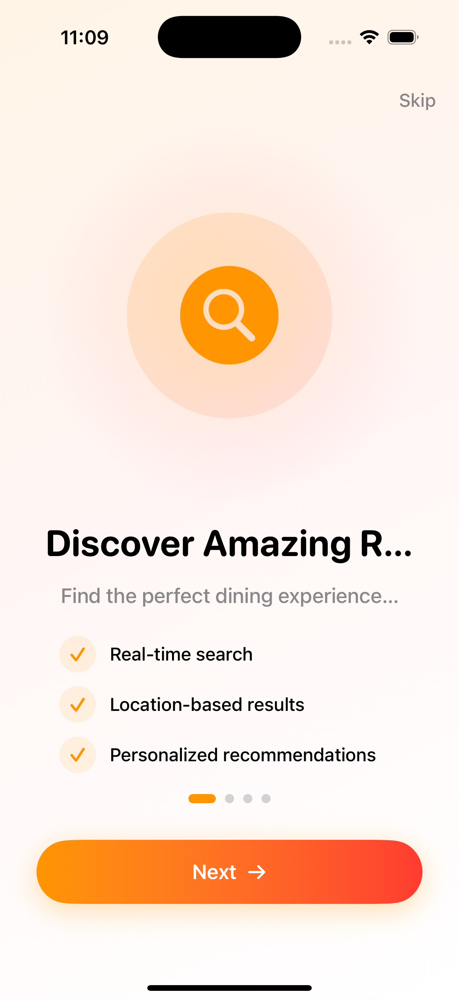
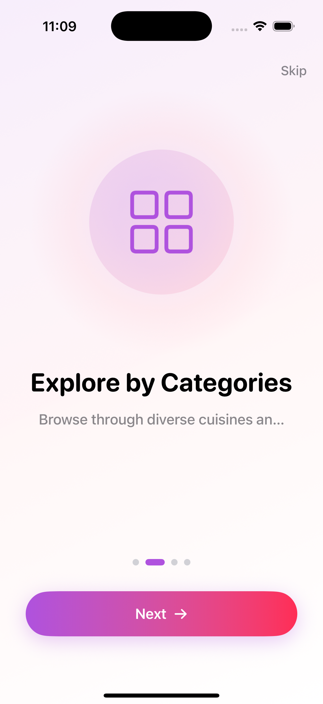
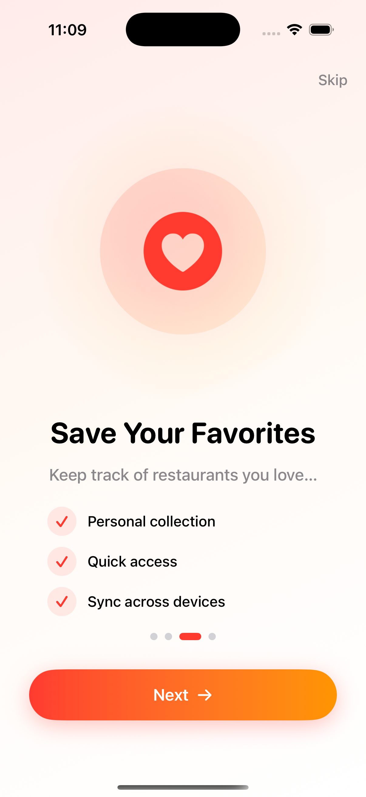
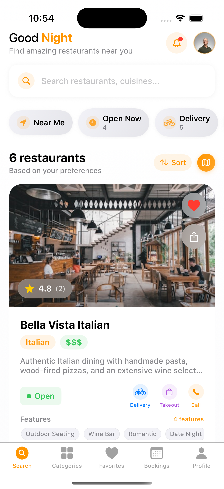
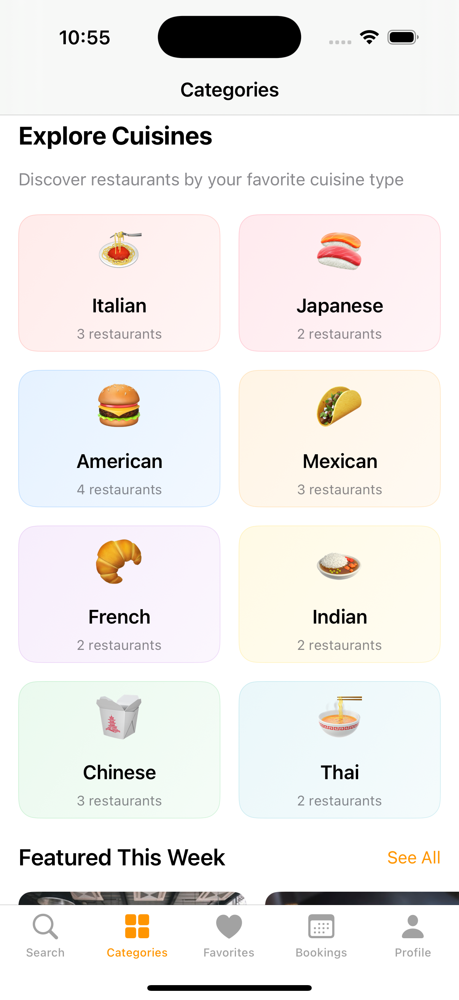
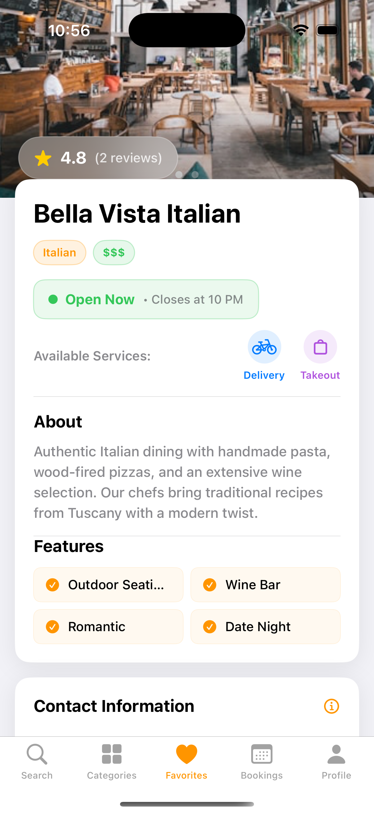
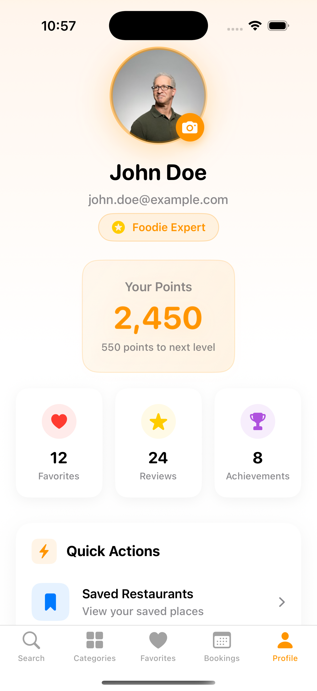

# 🍽️ FoodieFinder

**Discover Amazing Restaurants Near You**

FoodieFinder is a modern, feature-rich iOS app built with SwiftUI that helps users discover, explore, and manage their favorite restaurants. With its intuitive design and powerful features, finding your next great meal has never been easier.

   

## 🎬 Welcome Experience

Experience our beautiful onboarding flow that introduces users to FoodieFinder's key features:

| Discover | Categories | Favorites | Profile |
|----------|------------|-----------|---------|
|  |  |  |  |

### **Onboarding Features**

- **📖 Step-by-Step Introduction**: Four carefully crafted screens explaining core features
- **✨ Smooth Animations**: Fluid transitions and engaging micro-interactions
- **🎯 Feature Highlights**: Clear explanations of search, categories, favorites, and profile
- **🚀 Call-to-Action**: Prominent "Get Started" button to begin the journey

## 📱 Main App Screenshots

| Home/Search | Categories | Favorites | Profile |
|-------------|------------|-----------|---------|
|  |  |  |  |

*Add your screenshots to a `screenshots` folder in the project root with the following structure:*

```
screenshots/
├── welcome/
│   ├── welcome_1.png
│   ├── welcome_2.png
│   ├── welcome_3.png
│   └── welcome_4.png
├── home.png
├── categories.png
├── favorites.png
└── profile.png
```

## ✨ Key Features

### 🎭 **Premium Onboarding Experience**

- **Beautiful Welcome Flow**: Modern, animated introduction to app features
- **User-Friendly Tour**: Step-by-step walkthrough of key functionality
- **Skip Option**: Users can skip onboarding if they prefer
- **Persistent State**: Onboarding only shows once per installation
- **Engaging Animations**: Smooth transitions and delightful interactions

### 🔍 **Smart Search & Discovery**

- **Advanced Search**: Find restaurants by name, cuisine, or location
- **Real-time Filtering**: Filter by cuisine type, price range, and availability
- **Location-based Results**: Discover restaurants near you with precise distance calculations
- **Recent Searches**: Quick access to your previous searches
- **Smart Suggestions**: Get personalized restaurant recommendations

### 🏷️ **Category Exploration**

- **Cuisine Categories**: Browse restaurants by cuisine type (Italian, Japanese, American, etc.)
- **Featured Restaurants**: Curated selection of trending and popular places
- **Visual Discovery**: Beautiful category cards with cuisine icons and restaurant counts
- **Quick Navigation**: Easy access to category-specific restaurant lists

### ❤️ **Favorites Management**

- **Personal Collection**: Save your favorite restaurants for quick access
- **One-tap Favoriting**: Heart icon to instantly add/remove favorites
- **Persistent Storage**: Your favorites are saved across app sessions
- **Easy Organization**: View all favorites in a dedicated tab

### 👤 **User Profile & Personalization**

- **User Dashboard**: Comprehensive profile with stats and achievements
- **Points System**: Earn points for reviews and app interactions
- **Level Progression**: Advance through foodie levels (Expert, Connoisseur, etc.)
- **Activity Tracking**: Monitor favorites, reviews, and dining history

## 🎨 Design & User Experience

### **Modern Interface**

- **SwiftUI Architecture**: Built with the latest iOS design patterns
- **Premium Design**: Clean, modern interface with smooth animations
- **Dark Mode Support**: Seamless adaptation to system appearance
- **Accessibility**: VoiceOver support and dynamic type scaling

### **Intuitive Navigation**

- **Tab-based Structure**: Easy access to all major features
- **Contextual Actions**: Quick actions available where you need them
- **Smooth Transitions**: Fluid animations between screens
- **Gesture Support**: Intuitive touch interactions

### **Visual Appeal**

- **High-quality Images**: Beautiful restaurant photos and imagery
- **Consistent Branding**: Orange accent color throughout the app
- **Typography**: Carefully chosen fonts for optimal readability
- **Card-based Layout**: Information organized in digestible cards

## 🛠️ Technical Features

### **Core Technologies**

- **SwiftUI**: Modern declarative UI framework
- **Core Location**: GPS-based restaurant discovery
- **MapKit**: Interactive restaurant maps
- **Combine**: Reactive programming for data flow
- **UserDefaults**: Local data persistence

### **Architecture**

- **MVVM Pattern**: Clean separation of concerns
- **ObservableObject**: Reactive state management
- **Modular Design**: Reusable components and views
- **Protocol-Oriented**: Flexible and testable code structure

### **Performance**

- **Lazy Loading**: Efficient memory usage with lazy stacks
- **Image Caching**: Optimized image loading and caching
- **Background Processing**: Non-blocking UI operations
- **Memory Management**: Proper resource cleanup

## 📊 App Structure

```
FoodieFinder/
├── 📱 Views/
│   ├── MainView.swift          # Home/Search screen
│   ├── CategoriesView.swift    # Cuisine categories
│   ├── FavoritesView.swift     # Saved restaurants
│   ├── ProfileView.swift       # User profile
│   └── DetailView.swift        # Restaurant details
├── 🎨 Components/
│   ├── PremiumRestaurantCard.swift
│   ├── ModernStatCard.swift
│   └── EnhancedFilterView.swift
├── 💾 Models/
│   ├── Restaurant.swift        # Restaurant data model
│   └── User.swift             # User profile model
├── 🔧 ViewModels/
│   └── RestaurantViewModel.swift
└── 🎯 Utils/
    └── LocationManager.swift
```

## 📖 User Guide

### **Getting Started**

1. **Launch the App**: Open FoodieFinder on your iOS device
2. **Complete Onboarding**: Learn about key features through the welcome flow
3. **Allow Location**: Grant location permission for personalized results
4. **Explore**: Browse restaurants using search or categories
5. **Discover**: View detailed restaurant information and photos
6. **Save**: Add restaurants to favorites for quick access

### **Search Tips**

- Use specific cuisine names for better results
- Try location-based searches ("Italian near me")
- Apply filters to narrow down options
- Check recent searches for quick access

### **Managing Favorites**

- Tap the heart icon on any restaurant card
- View all favorites in the dedicated tab
- Remove favorites by tapping the heart again
- Favorites sync across app sessions

## 🚀 Future Enhancements

### **Planned Features v2.0**

- [ ] **Reservation System**

  - Table booking functionality
  - Booking management and status tracking
  - Real-time availability checking
  - Special request handling

- [ ] **Social Integration**

  - User reviews and ratings system
  - Photo sharing and community features
  - Friend recommendations and social dining
  - Review moderation and verification

- [ ] **Enhanced Personalization**

  - AI-powered recommendations
  - Dietary restriction filtering
  - Price preference learning
  - Mood-based suggestions

- [ ] **Extended Features**
  - Menu browsing and ordering
  - Loyalty program integration
  - Split bill calculator
  - Group dining coordination

### **Technical Improvements v2.0**

- [ ] **Backend Integration**

  - Real restaurant data API
  - User authentication system
  - Cloud data synchronization
  - Push notification service

- [ ] **Performance Optimization**

  - Core Data implementation
  - Advanced caching strategies
  - Offline mode support
  - Network optimization

- [ ] **Platform Expansion**
  - iPad optimization
  - watchOS companion app
  - macOS version
  - Apple TV browsing

## 🎯 Target Audience

### **Primary Users**

- **Food Enthusiasts**: People who love discovering new restaurants
- **Busy Professionals**: Users needing quick restaurant discovery solutions
- **Travelers**: Visitors looking for local dining recommendations
- **Social Diners**: Groups planning meals and gatherings

### **Use Cases**

- Finding restaurants for special occasions
- Discovering local cuisine while traveling
- Managing regular dining preferences
- Planning group dinners and events
- Tracking dining experiences and favorites

## 🏆 Key Achievements

### **User Experience**

- ⭐ **Intuitive Design**: Easy-to-use interface with minimal learning curve
- 🚀 **Fast Performance**: Smooth scrolling and quick data loading
- 🎨 **Visual Appeal**: Modern design that delights users
- ♿ **Accessibility**: Inclusive design for all users

### **Technical Excellence**

- 📱 **Native iOS**: Built specifically for iOS with platform best practices
- 🔧 **Clean Code**: Well-structured, maintainable codebase
- 🧪 **Tested**: Comprehensive testing for reliability
- 📊 **Scalable**: Architecture ready for future enhancements

## 🛡️ Privacy & Security

### **Data Protection**

- **Local Storage**: User preferences stored securely on device
- **Location Privacy**: GPS data used only for restaurant discovery
- **No Tracking**: No unnecessary data collection or third-party tracking
- **Secure Communication**: All network requests use HTTPS encryption

### **User Control**

- **Permission Management**: Clear control over location and notification access
- **Data Deletion**: Easy removal of personal data and search history
- **Transparency**: Clear privacy policy and data usage explanation

## 📱 Device Requirements

### **Minimum Requirements**

- iOS 15.0 or later
- iPhone 8 or newer
- 64MB of available storage
- Internet connection for restaurant data

### **Recommended**

- iOS 16.0 or later
- iPhone 12 or newer
- Location Services enabled
- Stable internet connection

## 🔧 Installation & Setup

### **For Users**

1. Download from the App Store (when released)
2. Install on your iOS device
3. Grant necessary permissions
4. Start discovering restaurants!

### **For Developers**

```bash
# Clone the repository
git clone https://github.com/yourusername/FoodieFinder.git

# Open in Xcode
cd FoodieFinder
open FoodieFinder.xcodeproj

# Build and run
# Select your target device/simulator
# Press ⌘+R to build and run
```

## 🤝 Contributing

We welcome contributions to make FoodieFinder even better! Please read our contributing guidelines before submitting pull requests.

### **Development Guidelines**

- Follow Swift coding conventions
- Write comprehensive tests
- Update documentation for new features
- Ensure UI/UX consistency

## 📄 License

This project is licensed under the MIT License - see the [LICENSE](LICENSE) file for details.

## 👨‍💻 Developer

**Swasti Sundar Pradhan**

- 📧 Email: [swastipradhan044@gmail.com.com]
- 🔗 LinkedIn: [linkedin.com/swasti-sundar]
- 🐙 GitHub: [github.com/swasti-sundar]

## 🙏 Acknowledgments

- SwiftUI community for inspiration and guidance
- Design inspiration from leading food apps
- Beta testers for valuable feedback
- Open source libraries and frameworks used

---

**Made with ❤️ by [Swasti](https://www.instagram.com/swasti-sundar)**

_FoodieFinder - Discover Your Next Great Meal_
